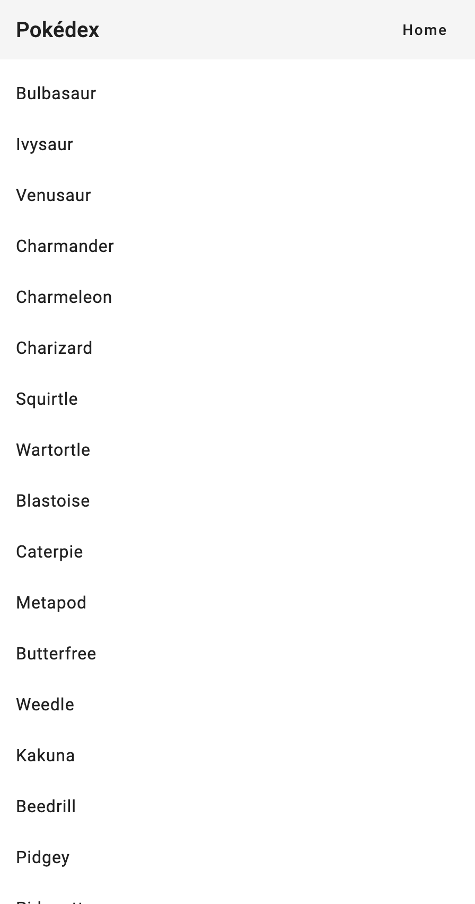
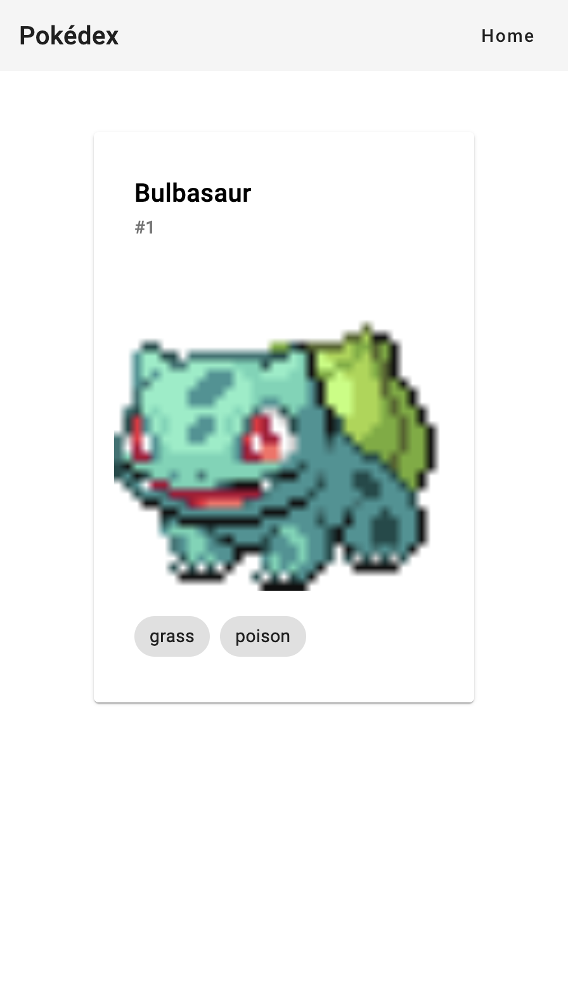
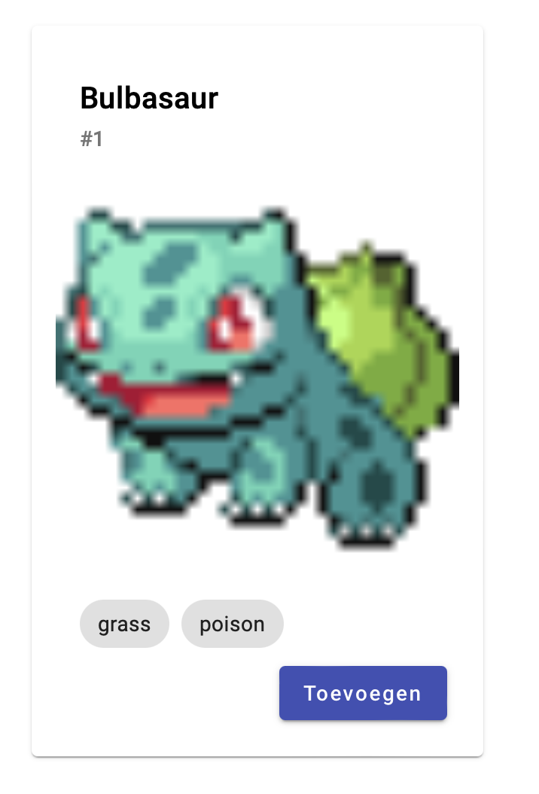
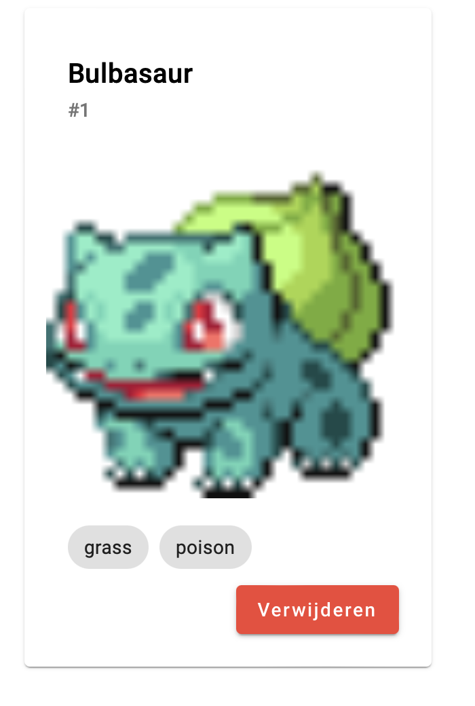
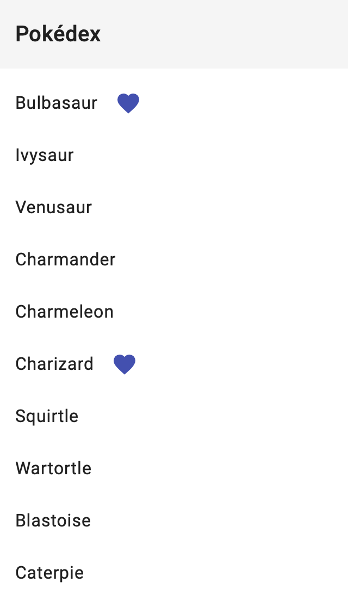
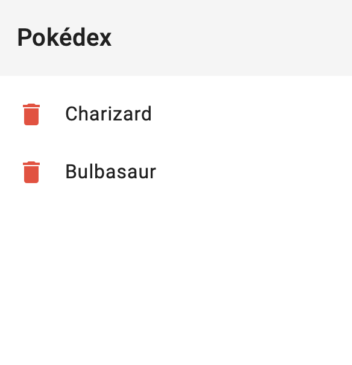
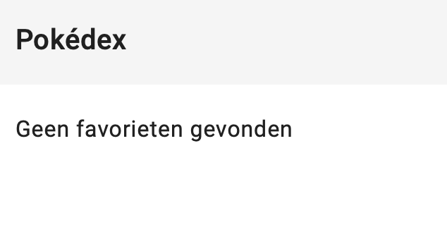

# Individuele opdracht

- Genereer een nieuw Vue-project (`npm create vue@latest pokedex`).
- Selecteer `TypeScript`, `Router`, `ESLint` en `Prettier`.

De hoofdopdracht gaat op 75% van de eindscore.
De extra functionaliteiten gaan op 25% van de eindscore.

## Kanban

Gebruik Trello om tickets aan te maken (functioneel, technisch, testen). Het mag een privé-bord zijn, naar het einde toe moet dit wel gedeeld worden met de docent. Verdeel de functionaliteiten in kleine tickets en werk deze één voor één af.

## Functionaliteit

Er wordt een `Pokédex` gebouwd die de volgende functionaliteit bevat:

- Een home view waarop een lijst van pokémon wordt getoond.
- Een detail view waarop de details van een pokémon worden getoond.

## Gebruikte componenten

Gebruik Vuetify om kant-en-klare componenten te gebruiken. Minimaal moeten de volgende componenten gebruikt worden:

- Toolbar
- List
- Button
- Card
- Chip

Het kan zijn dat de styling van jouw applicatie afwijkt van de screenshots in deze opdracht. Dat is geen probleem (de screenshots zijn van een andere Material Design library, en zullen dus afwijken van Vuetify).

## Minimale pagina's

- `/` waarop een lijst van pokémon wordt getoond.
- `/pokemon/:id` waarop de details van één pokémon worden getoond.

Maak gebruik van Routing.

## Service

Http-verzoeken verlopen via een `service`.

### Lijst



De calls om de lijst van 151 pokémon op te halen is: `https://pokeapi.co/api/v2/pokemon?limit=151`.

Dit geeft een response in de vorm van `ApiResponse`:

```ts
export interface ApiResponse {
  count: number;
  next: string;
  previous?: any;
  results: Array<PokemonInfo>;
}

export interface PokemonInfo {
  name: string;
  url: string;
}
```

Hiervan heb je dus de `results` nodig om de lijst van pokémon te tonen.

### Details



De details van één pokémon kan je ophalen via `https://pokeapi.co/api/v2/pokemon/${name}`, waarbij `name` de naam is van de pokémon (bijvoorbeeld `bulbasaur`).

De respons heeft de vorm van Pokemon:

```ts
export interface Pokemon {
  base_experience: number;
  height: number;
  id: number;
  name: string;
  sprites: Sprites;
  types: Array<Type>;
  weight: number;
}

interface Type {
  slot: number;
  type: Detail;
}

interface Sprites {
  back_default: string;
  front_default: string;
  versions: Versions;
}

interface Versions {
  "generation-v": Generationv;
}

interface Generationv {
  "black-white": BlackWhite;
}

interface BlackWhite {
  animated: Animated;
  back_default: string;
  back_female?: any;
  back_shiny: string;
  back_shiny_female?: any;
  front_default: string;
  front_female?: any;
  front_shiny: string;
  front_shiny_female?: any;
}

interface Animated {
  back_default: string;
  back_female?: any;
  back_shiny: string;
  back_shiny_female?: any;
  front_default: string;
  front_female?: any;
  front_shiny: string;
  front_shiny_female?: any;
}

interface Other {
  dream_world: Dreamworld;
  home: Home;
  "official-artwork": Officialartwork;
}

interface Officialartwork {
  front_default: string;
  front_shiny: string;
}

interface Home {
  front_default: string;
  front_female?: any;
  front_shiny: string;
  front_shiny_female?: any;
}

interface Dreamworld {
  front_default: string;
  front_female?: any;
}

interface Detail {
  name: string;
  url: string;
}
```

De bewegende afbeelding, op basis van de typings hierboven, kan dus aangesproken worden via:

```html

```

## Tips

Elke pagina is verantwoordelijk voor het ophalen van de data die nodig is om de pagina te tonen. Dit betekent dat de home view de lijst van pokémon ophaalt en de detail view de details van één pokémon.

## Extra functionaliteit (25% van de eindscore)

Op detailpagina:



Op listpagina:


Op favorietenpagina:



Toon een knop `Toevoegen`. Wanneer op deze knop geklikt wordt, moet de pokémon toegevoegd worden aan `de favorieten`.

Wanneer een pokémon aanwezig is in `de favorieten`, dan wordt een knop `Verwijderen` getoond. Wanneer op deze knop geklikt wordt, dan wordt de pokémon uit de lijst van favorieten verwijderd.

Wanneer een pokémon is toegevoegd aan de lijst van favorieten, dan zal er in het overzicht een hartje getoond worden naast de naam.

Voorzie een route `/favorieten` - hierop wordt de lijst van favorieten getoond met een vuilbakje ernaast. Als op het vuilbakje geklikt wordt, dan wordt de pokémon verwijdert van de pagina. Indien er geen favorieten zijn, toon dan `Geen favorieten gevonden`.

### Tips

Je kan de lijst van favorieten bijhouden als een array van strings (waarbij de naam van de pokémon bepalend is of deze wél of niet als favoriet gezien wordt).

Hou deze lijst van favorieten bij in localStorage - als de app opnieuw wordt opgestart, wordt de lijst van favorieten terug ingeladen.

## Extra uitdaging (niet op punten)

Geef de card een background color die overeenkomt met het eerste type van de pokémon.

Bijvoorbeeld: Bulbasaur is `grass` en `poison`, de kleur van `grass` is groen -> groene achtergrond.

Charmander is `fire`. De kleur van `fire` is oranje/rood -> oranje/rode achtergrond.
